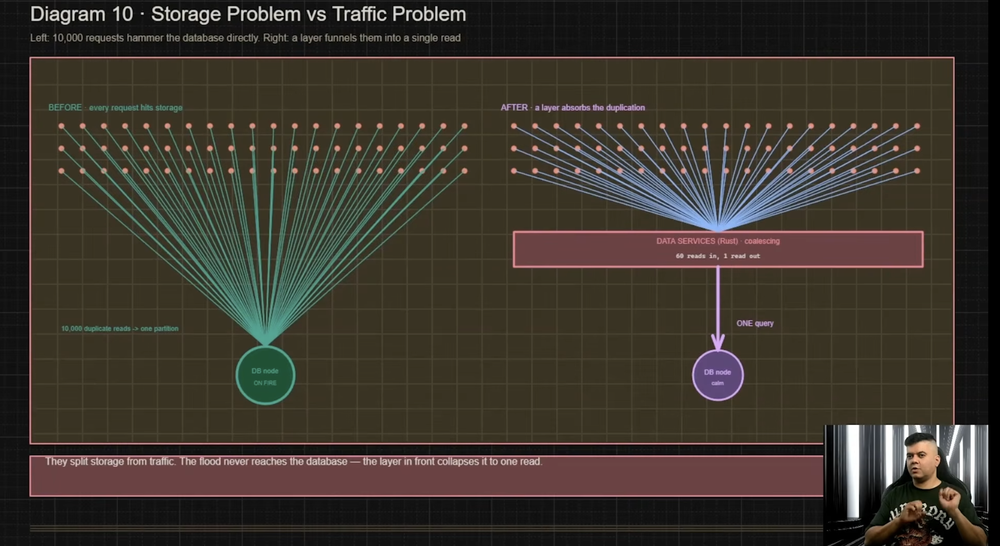

# How DISCORD Stores 1 TRILLION Messages

> https://www.youtube.com/watch?v=1mZI6drojpY  
> application의 상황에 맞는 솔루션을 골라서 올바르게 사용하는 것이 핵심이다

- Discord의 초기 핵심 결정: 채널의 메시지를 절대로 삭제하지 않는다
- 아키텍쳐를 채용할 떄는 모든 최악의 상황을 살펴봐야한다
  - 특히 discord처럼 극단적인 환경(1 trillion messages)은 디자인에서 나올 수 있는 최악의 상황이 무조건 발생한다
  - 솔루션/아키텍쳐를 채택할 때 반드시 극단적인 최악의 상황을 생각 해야한다

## 서비스 시작: MongoDB

- 2015년 서비스 초기에는 MongoDB로 시작하고, 이것은 규모에 맞는 올바른 선택이었다
  - 하지만 메시지가 1억건 이상 쌓이게되면서 MongoDB에 data와 index가 더 이상 memory에 저장되지 않았다(memory가 부족해서 문제가 발생)

## Cassandra로의 마이그레이션

- 이를 극복하기위해 Cassandra로 database를 마이그레이션 했다
  - cassandra의 특징들이 discord가 원하는 상황에 정확히 일치하였다
    - NO SPOF
    - 분산형 노드의 추가로 확장 가능(12개로 시작)
    - discord의 메시지는 쓰기가 대부분이며 과거의 메시지는 거의 삭제되지 않으므로 append only를 빠르게 사용할 수 있을 것(O(1))
    - 최신 메시지를 빠르게 쿼리할 수 있을 것
- cassandra의 노드를 추가(177개)함으로써 발생한 상황은 아래와 같다
  - data가 노드당 균등 분배가 되지않는다
    - discord의 channel은 issue에 따라 hot partition이 계속해서 바뀌고, 부하가 집중되는 노드가 생긴다
  - cassandra는 java로 구현되어 있어 GC비용이 존재해, 이 시간동안 부하를 심화시키고 시스템의 예측을 불가능하게 했다

## Hot partion 문제의 해결: Data Services(Rust) 계층의 추가

- discord의 요청들을 분석한 결과 결국 hot partition에 요청하는 쿼리는 결국 비슷한 것을 요구하는 것이 많다는 사실을 발견했다
  - 이 문제를 해결하게위해 application server와 database사이에 중간 layer를 추가하였다
    - Rust로 구성된 이 layer는 GC가 없어서 예측 가능했다
    - 같은 데이터가 필요한 요청의 경우 database에 여러 번의 쿼리를 날리는 것이 아니라, data services layer를 통해서 한번의 쿼리로 해결한다
- consistency hash를 사용해 같은 채널은 동일 위치의 data service에 도착하기에 안정적으로 제공 될 수 있다

## 최종 해결책: ScyllaDB로의 마이그레이션

- ScyllaDB는 카산드라와 호환되지만 C++로 작성되어 GC 정지가 없고, 코어당 샤딩(Shard-per-core) 아키텍처를 사용하여 핫 파티션 제어에 훨씬 유리하다
  - Shard-per-core
    - CPU core가 자체 데이터 및 메모리 조각을 소유하는 방법이다
    - 부하시 훨씬 더 일관된 성능을 제공하고 hot partition 문제를 해결해준다

## 마지막 문제: 데이터 마이그레이션(backfill)

- 기존 ScyllaDB의 기존 마이그레이션 도구를 사용할 경우 3개월의 시간이 걸린다고 판단했다
- 그래서 그것을 해결하기 위해 discord 엔지니어들은 맞춤형 Rust 기반 마이그레이터를 개발하여 초당 320만 개의 메시지를 복사했고, 원래 3개월이 걸릴 백필 작업을 단 9일 만에 무중단으로 완료했다

## 결과/교훈

- 기존 177개의 카산드라 노드를 단 72개의 ScyllaDB 노드로 대폭 줄였으며, 읽기 지연 시간은 15ms, 쓰기 지연 시간은 5ms 수준으로 매우 안정화되었다
- 10억 개의 record를 버텨낸 데이터베이스가 1조 개의 행에서도 살아남을 수는 없으며, 대규모 시스템에서는 평균적인 트래픽이 아닌 '최악의 시나리오(가장 극단적인 요청)'를 기준으로 아키텍처를 설계해야 한다