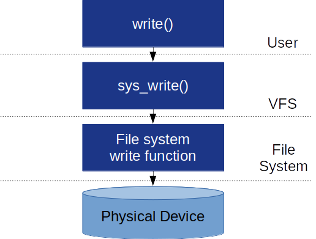

# 리눅스 파일 시스템

## VFS (Virtual File System)

- OS를 사용할때 사용하는 저장장치들은 다른 파일시스템을 사용하고 있으며, 각 파일시스템은 파일 관리방법과 읽기, 쓰기의 방식이 모두 다르다
  - 그러나 우리는 이러한 일들을 아무런 어려움 없이 해내는데, 이것은 VFS의 도움이다
- VFS는 파일시스템 관련 인터페이스를 사용자 공간 어플리케이션에 제공하는 커널 서브시스템이다
  - VFS는 다양한 파일시스템들이 공존할 수 있도록 공통된 인터페이스를 제공한다
  
  - 즉, open(), read(), write() 등의 시스템콜을 호출했을 때, 각 파일시스템이나 물리적 매체의 종류와 상관없이 동작하게 해주는 역할을 한다
  - VFS는 사용자가 write()라는 함수를 호출해도 자체적으로 파일시스템에 알맞는 함수를 호출하여 쓰기를 진행하기 때문에 사용자는 연결된 파일시스템이 어떤 것이냐를 신경쓰지 않고도 읽고 쓰기를 자유롭게 할 수 있는 것이다
- VFS의 주요한 네 가지 객체는 슈퍼블록(SuperBlock), 아이노드(Inode), 덴트리(Dentry), 파일(File)이 있다

## 슈퍼 블록(SuperBlock)

- 슈퍼블록 구조체는 linux-5.0.1/include/linux/fs.h 안에 정의되어 있다
- linux-5.0.1은 버전에 따라서 폴더이름이 달라진다
- 슈퍼블록은 각 파일시스템별로 구현하며, 파일시스템 메타데이터
- 여기에는 파일시스템의 유형과 크기, 상태, 다른 메타데이터 구조체의 정보가 들어있다 
- 슈퍼블록은 매우 중요하기 때문에 복사본을 여러 곳에 저장해 놓기도 한다

## 아이 노드(INode)

- 파일의 고유번호이며, 리눅스의 파일이름은 아이노드 번호에 붙여진 별명에 불과하다
- 슈퍼블록이 파일시스템 전반에 걸친 메타데이터를 저장했다면, 아이노드는 파일 각각의 메타데이터를 유지
- 슈퍼블록은 이 아이노드들의 리스트를 유지하여 각각의 파일에 대한 메타데이터를 유지
- 아이노드는 파일의 주인(User, Group), 접근 권한, 파일 타입 등의 다양한 파일 정보를 가지고 있다
- 리눅스 시스템의 경우에는 디스크에 아이노드를 유지하고 있어서 메모리에 읽어오기만 하면되지만, 특정 파일시스템의 경우에는 아이노드를 자체적으로 유지하고 있지 않은 파일시스템도 존재
- 따라서 이러한 파일시스템들은 디스크에 아이노드가 저장되어 있지는 않지만, VFS에 마운트 되기 위해서는 반드시 메모리 상에 아이노드 객체를 구축해야한다
- struct inode는 슈퍼블록과 동일하게 linux-5.0.1/include/linux/fs.h에 정의되어 있다

## 덴트리(Dentry)

- 덴트리(Dentry)는 디렉토리 엔트리(Directory Entry)의 약자이다
- 처음에는 존재하지 않으나, 파일이 실행될때 생성되며 캐싱되어 재사용 된다
  - 덴트리 객체는 슈퍼블록이나 아이노드와 같이 디스크에 저장되는 것이 아닌, 메모리에서 사용자 패턴에 동적으로 생기고 없어진다
  - VFS는 경로명을 사용할 때마다 먼저 덴트리 캐시에서 찾고, 캐시에 없을 경우 직접 경로를 탐색
  - 파일의 계층 구조를 관리하며, 경로 depth마다 덴트리 객체가 생성된다
- 덴트리는 아이노드와 파일 이름을 관련하여 파일과 아이노드를 인덱싱하는 역할을 한다
  - 덴트리는 캐시를 유지하여 자주 접근되는 경로를 더 빠르게 접근할 수 있도록 도와준다
  - 경로 탐색은 문자열 비교가 필요한 작업이기 때문에 상당히 비용이 큰 작업이다
  - 따라서 이러한 비교 작업을 계속해서 반복하는 것은 비효율적이므로 이를 객체화시켜 반복되는 작업을 없앤다

## 파일(File)

- 파일 객체는 프로세스가 사용중인 파일을 표현하는 객체
- 아이노드가 파일의 "정적 정보(권한, 크기 등)"를 담고 있다면, 파일 객체는 해당 파일을 연 프로세스가 "현재 어디까지 읽었는지(Offset)", "어떤 모드(Read/Write)로 열었는지" 같은 동적인 상태 정보를 담는다
- 하나의 파일(아이노드)을 두 개의 프로세스가 동시에 열면, 아이노드는 하나지만 파일 객체는 각각 생성된다
  - 리눅스 커널 수준에서 파일을 동시에 Write(w) 권한으로 여는 것 자체는 가능하며, 개발자가 책임을 져야한다
- 파일 객체는 프로세스와 VFS를 잇는 실행 시간 연결 고리이다