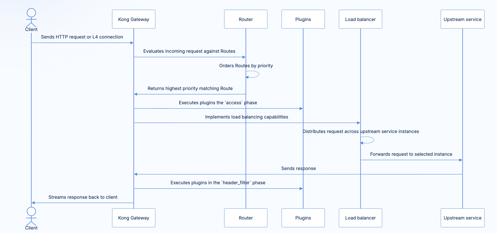

# Kong Engine의 동작(Enterprise)

> https://developer.konghq.com/gateway/traffic-control/proxying/

1. Kong Gateway는 8000/8443 port에서 Listen(L7, HTTP/HTTPS)한다
2. Kong Gateway는 Route부터 탐색하여 맞는 endpoint를 반환한다
  - Route는 Service의 참조를 소유하고 있어서 Route를 판정한 후 소유한 Service의 Domain을 이용해 위치를 특정할 수 있으며, CSS와 같이 Specific match가 우선순위를 갖는 규칙으로 매칭시킨다(중복 값이 없는 Route를 만드는게 아키텍처의 핵심이다)
    - user custom unique value를 route에 추가함으로써 중복을 회피하고, 명확한 endpoint를 만들 수 있다
3. 플러그인을 통해 접근 가능한지 판정한다
  - ACL, Ratelimit 등의 plugin을 Service에 넣어 적용 시킬 수 있다(원하는 플러그인과 조건에 따라 플러그인이 위치해야할 곳이 다르다)
    - ratelimit plugin 동작은 config중 Identifer를 이용해 정의한다
    - Identifier 설정: `The type of identifier used to generate the rate limit key. Defines the scope used to increment the rate limiting counters. Note if identifier is consumer-group, the plugin must be applied on a consumer group entity. Because a consumer may belong to multiple consumer groups, the plugin needs to know explicitly which consumer group to limit the rate.` - 출처(https://developer.konghq.com/plugins/rate-limiting-advanced/reference/)
      - ratelimit의 스코프를 정의하는 것이 Identifier이다
        - service로 적용하면 service가 bucket이 되고, consumer로 적용하면 consumer를 bucket으로 사용한다
        - Identifier는 ratelimit 알고리즘의 bucket을 지정하는 config이다
      - consumer group만 예외로 consumer group에 직접적으로 plugin을 넣어야한다
  - ACL은 Key-Auth 등 auth 플러그인을 통해서 consumer_id를 얻어내고, consumer_id를 통해 ACL 접근 권한을 확인해 접근을 제어한다
    - 플러그인 한가지를 이용하는 것이 아니라, 여러가지를 조합해서 결과를 낸다
4. kong은 앞선 단계에서 결정된 Upstream 정보, 변형된 헤더, 인증된 정보 등을 바탕으로 요청을 전달해 lb(upstream)로 요청을 보내고 결과를 받아 client에게 반환한다