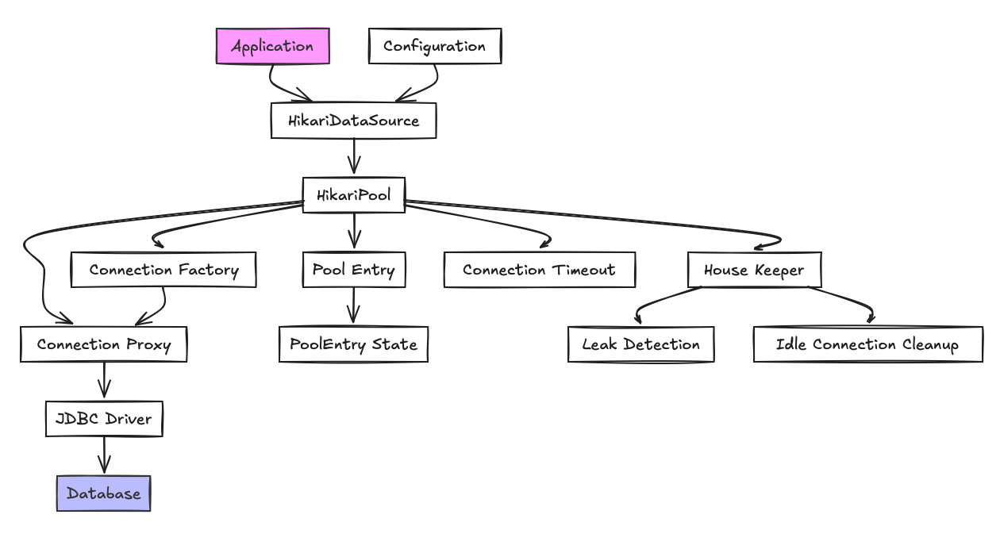

# DataSource의 흐름

- DataSource는 Connection을 획득하기 위한 팩토리 인터페이스이다
  - 이전에는 DriverManager를 통해 직접 연결을 생성했다(`DriverManger.getConnection()`)

## HikariDataSource

- Hikari Connection Pool은 HikariDataSource 구현체를 사용한다
  - 내부적으로 HikariPool을 가지고있다
    - HikariPool이 없다면 풀 생성을 하고 커넥션을 받아오고, 풀이 존재한다면 풀에서 커넥션을 받아온다
    - 만약 풀이 있지만 커넥션이 없다면 maxConnection 설정에 따라 maxConnection 갯수에 도달하지 않았다면 추가 커넥션을 생성한다
    - maxConnection에 도달하면 connectionTimeout설정에 따라 시간 지연 후 예외를 던진다
  - 즉, client가 dataSource.getConnection()을 호출하면, HikariDataSource는 내부의 HikariPool에 연결을 요청한다
