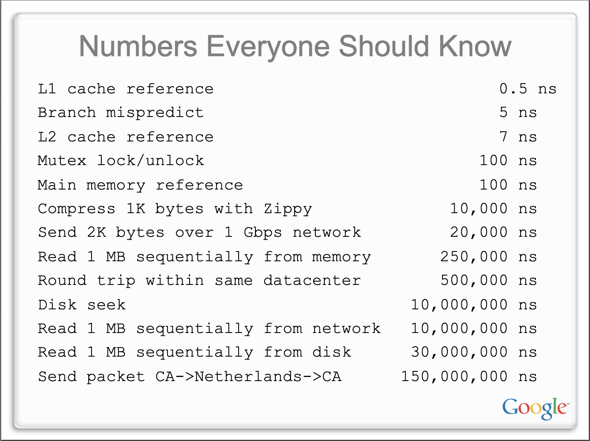

# Computer Study

```plaintext
공부를 위해 여러 자료를 찾아보며 올바르고 자세한 자료를 찾기 어려운 경우가 많았습니다.
그래서 시간 낭비를 줄이고자 전문가 강의/ 전공책/ 공식문서를 바탕으로 올바른 자료를 찾아 정리하기 시작했습니다.
Markdown으로 학습 내용을 정리하고 있습니다.
```

- 외우기
  

## INDEX

- [개발 상식](#개발-상식)
  - [WebRTC](#webrtc)
  - [GITHUB](#github)
- [아키텍쳐](#아키텍쳐)
  - [대규모 아키텍쳐 설계](#대규모-아키텍쳐-설계)
- [운영체제](#운영체제)
  - [운영체제-주니온](#운영체제-주니온)
  - [운영체제-널널한개발자](#운영체제-널널한개발자)
  - [운영체제-최린](#운영체제-최린)
  - [리눅스-명령어](#리눅스-명령어)
  - [리눅스-운영체제](#리눅스-운영체제)
  - [PintOS](#pintos)
  - [OS구조와 원리](#os구조와-원리)
  - [System Call](#system-call)
- [네트워크](#네트워크)
  - [(학부 24-1) 통신 및 네트워크 개론](#학부-24-1-통신-및-네트워크-개론)
  - [네트워크 기초](#네트워크-기초)
- [데이터베이스](#데이터베이스)
  - [김영한 실전 데이터 베이스 로드맵](#김영한-실전-데이터-베이스-로드맵)
    - [김영한의 실전 데이터 베이스 입문 - SQL부터 차근차근](#김영한의-실전-데이터-베이스-입문---sql부터-차근차근)
    - [김영한의 실전 데이터 베이스 - 기본편](#김영한의-실전-데이터-베이스---기본편)
    - [김영한의 실전 데이터 베이스 - 설계편](#김영한의-실전-데이터-베이스---설계편)
    - [김영한의 실전 데이터 베이스 - 성능 최적화와 고급 기능편](#김영한의-실전-데이터-베이스---성능-최적화와-고급-기능편)
  - [국민대학교 김남규 교수/데이터 베이스 실무](#국민대학교-김남규-교수데이터-베이스-실무)
  - [MYSQL](#mysql)
  - [Redis](#redis)
  - [SQLP](#sqlp)
    - [친절한 SQL 튜닝](#친절한-sql-튜닝)
- [멀티스레드와 동시성](#멀티스레드와-동시성)
  - [동시성 프로그래밍](#동시성-프로그래밍)
- [Interpreter](#interpreter)
- [C](#c)
  - [독하게 C를 배운사람을 위한 선형 자료구조](#독하게-c를-배운사람을-위한-선형-자료구조)
- [JAVA](#java)
  - [JVM](#jvm)
  - [OOP](#oop)
  - [Spring](#spring)
  - [JPA](#jpa)
  - [SpringSecurity](#springsecurity)
  - [Webflux](#webflux)
- [Javascript](#javascript)
  - [Typescript](#typescript)
  - [Nodejs](#nodejs)
  - [GraphQL/Prisma](#graphqlprisma)
  - [Vue](#vue)
- [JAVA 와 JS의 차이](#java-와-js의-차이)
- [Rust](#rust)
- [SASM](#sasm)
- [디자인패턴](#디자인패턴)
- [자료구조](#자료구조)
- [알고리즘](#알고리즘)
  - [MIT 6.006 Introduction to Algorithms](#mit-6006-introduction-to-algorithms)
- [프로그래밍 대회에서 배우는 알고리즘 문제 해결 전략(종만북)](#프로그래밍-대회에서-배우는-알고리즘-문제-해결-전략종만북)
- [Kong Gateway](#kong-gateway)
- [Swagger](#swagger)
- [MCP](#mcp)
- [Hashicorp Vault](#hashicorp-vault)
- [Jenkins-Docker-AWS](#jenkins-docker-aws)
- [Docker \& Kubernetes: The Practical Guide - 2025 Edition](#docker--kubernetes-the-practical-guide---2025-edition)
- [Kubernetes](#kubernetes)
- [Front 최적화](#front-최적화)
- [기술 면접](#기술-면접)
- [bitlibrary-개발일지](#bitlibrary-개발일지)
- [정보처리기사 실기](#정보처리기사-실기)
- [참고 강의](#참고강의)
- [참고 자료](#참고자료)

---

## 개발 상식

- [프로그래밍이란?](CS/CommonSense/Programing.md)
- [서버란 무엇인가?](CS/CommonSense/Server.md)
- [클린코드/주석](CS/CommonSense/CleanCode.md)
- [TDD(Test Driven Development)](CS/CommonSense/TDD.md)
- [OOP(Object-Oriented Programming)](CS/CommonSense/OOP.md)
- [SOLID](CS/CommonSense/SOLID.md)
- [DRY](CS/CommonSense/DRY.md)
- [WATERFALL](CS/CommonSense/WaterFall.md)
- [AGILE](CS/CommonSense/Agile.md)
- [프로토콜/인터페이스](CS/CommonSense/Protocol.md)
- [Base64](CS/CommonSense/Base64.md)
- [CRDT(Conflict-free Replicated Data Type)/LWW-Register](CS/CommonSense/CRDT.md)
- [CORS](CS/CommonSense/CORS.md)
- [CI/CD](CS/CommonSense/CI_CD.md)
- [Load Balancing](CS/CommonSense/Load_Balancing.md)
- [Managed language / Unmanaged language](CS/CommonSense/Managed.md)
- [단축평가](CS/CommonSense/Short_evaluation.md)
- [API](CS/CommonSense/API.md)
- [REST](CS/CommonSense/Restapi.md)
- [Refactoring](CS/CommonSense/Refactoring.md)
- [Trailing slash](CS/CommonSense/TrailingSlash.md)
- [Compile](CS/CommonSense/Compile.md)
- [Functional Programming](CS/CommonSense/FunctionalProgramming.md)
- [LLM](CS/CommonSense/LLM.md)
- [Street Coder](CS/CommonSense/StreetCoder.md)
- [gRPC](CS/CommonSense/gRPC.md)
- [sync,async,blocking,non-blocking](CS/CommonSense/SyncAsyncBlockingNonBlocking.md)
- [대칭키, 비대칭키](CS/CommonSense/Symetrickey.md)
- [공변, 불공변](CS/CommonSense/Covariant.md)

---

### WebRTC

- [WebRTC](CS/WebRTC/WebRTC.md)
- [SequenceDiagram](CS/WebRTC/SequenceDiagram.md)

---

### GITHUB

- [git이란?](CS/GIT/GIT.md)
- [git의 구조](CS/GIT/Structure.md)
- [HEAD/Snapshot](CS/GIT/Head.md)
- [Stash](CS/GIT/Stash.md)
- [Merge](CS/GIT/Merge.md)
- [linux-ssh인증](CS/GIT/Linux-SSH.md)

---

## 아키텍쳐

- [클린 아키텍쳐](CS/Architecture/Clean.md)

---

### 대규모 아키텍쳐 설계

> https://www.udemy.com/course/software-architecture-design-large-scale-systems

- [좋은 API 설계](CS/ArchitectureDesign/API.md)
- [REST API](CS/ArchitectureDesign/RestAPI.md)

---

## 운영체제

- [컴퓨터의 기본 구조](CS/OS/Computer.md)
- [메모리의 구조](CS/OS/Memory.md)
- [운영체제란?](CS/OS/OperationSystem.md)
- [가상메모리/페이지교체](CS/OS/Paging.md)
- [파일시스템](CS/OS/File.md)
- [System Call](CS/OS/SystemCall.md)
- [프로세스와 스레드](CS/OS/Process&Thread.md)
  - [STACK의 구조](CS/OS/Stack.md)
  - [컨텍스트 스위칭](CS/OS/ContextSwitching.md)
- [동시성제어](CS/OS/Concurrency.md)
- [부동 소수점/고정 소수점](CS/OS/FloatingPoint.md)

---

### 운영체제-주니온

> https://www.inflearn.com/course/%EC%9A%B4%EC%98%81%EC%B2%B4%EC%A0%9C-%EA%B3%B5%EB%A3%A1%EC%B1%85-%EC%A0%84%EA%B3%B5%EA%B0%95%EC%9D%98

> [참고자료(공룡책)](https://product.kyobobook.co.kr/detail/S000001868743)

- [운영체제란?](CS/Joonion/OperationSystem.md)
- [Process](CS/Joonion/Process.md)
- [Thread](CS/Joonion/Thread.md)
- [CPU Scheduling](CS/Joonion/CPUScheduling.md)
- [Synchronization tools](CS/Joonion/Synchronization.md)
- [Deadlock](CS/Joonion/Deadlock.md)
- [Main Memory](CS/Joonion/MainMemory.md)
- [Virtual Memory](CS/Joonion/VirtualMemory.md)
- [Storage Management](CS/Joonion/StorageManagement.md)
- [I/O Systems](CS/Joonion/IOSystems.md)
- [File System](CS/Joonion/FileSystem.md)

---

### 운영체제-널널한개발자

> https://www.youtube.com/playlist?list=PLXvgR_grOs1BQCziQ_MpM877BdBxwbMzA

- [컴퓨터의 기본 구조](CS/OS/NullNull/Structure.md)
- [1비트와 진법](CS/OS/NullNull/bitsAndBase.md)
- [CPU의 작동원리](CS/OS/NullNull/CPU.md)
- [운영체제](CS/OS/NullNull/OS.md)

---

### 운영체제-최린

> http://www.kocw.net/home/cview.do?cid=5e94ceee75415112

- [운영체제 개요](CS/OS/ChoiLyn/OperationIntro.md)
- [운영체제 역사](CS/OS/ChoiLyn/OperationHistory.md)
- [프로세스](CS/OS/ChoiLyn/OperationProcess.md)
  - [프로세스](CS/OS/ChoiLyn/Process.md)
- [Exception, Thread](CS/OS/ChoiLyn/ExceptionAndThread.md)
- [쓰레드](CS/OS/ChoiLyn/Thread.md)
- [상호 배제와 동기](CS/OS/ChoiLyn/MutexSync.md)

---

### 리눅스-명령어

- [리눅스란?](CS/OS/Linux/Linux.md)
- [WSL](CS/OS/Linux/WSL.md)
- [명령어 구조](CS/OS/Linux/Command.md)
- [파일시스템](CS/OS/Linux/File.md)
- [파일](CS/OS/Linux/CreateFile.md)
- [Nano](CS/OS/Linux/Nano.md)
- [삭제,복사,이동](CS/OS/Linux/Rm.md)
- [파일 다루기](CS/OS/Linux/UseFile.md)
- [리다이렉션](CS/OS/Linux/Redirection.md)
- [파이프](CS/OS/Linux/Pipe.md)
- [확장](CS/OS/Linux/Expansion.md)
- [찾기](CS/OS/Linux/Find.md)
- [grep](CS/OS/Linux/grep.md)
- [권한](CS/OS/Linux/Permission.md)
- [환경](CS/OS/Linux/Environment.md)
- [Scripting](CS/OS/Linux/Scripting.md)
- [Cron](CS/OS/Linux/Cron.md)

---

### 리눅스-운영체제

- [Linux와 SystemCall](CS/OS/Linux/LinuxSystemCall.md)

---

### PintOS

- [PintOS](CS/pintOS/StartPintOS.md)

---

### OS구조와 원리

> https://github.com/gunhaa/LoopyOS

> https://www.yes24.com/Product/Goods/2508562

- [day1](CS/OS/dailyOS/day1.md)
- [day2](CS/OS/dailyOS/day2.md)
- [day3](CS/OS/dailyOS/day3.md)
- [day4](CS/OS/dailyOS/day4.md)

---

### System Call

- [iocp, epoll, kqueue)](CS/SystemCall/Iocp.md)

---

## 네트워크

- [모든 개발자를 위한 HTTP 웹 기본 지식 정리 - 김영한](CS/Network/Basic.md)
  - [PORT](CS/Network/Port.md)
  - [URI](CS/Network/URI.md)
  - [쿠키](CS/Network/Cookie.md)
  - [캐시](CS/Network/Cache.md)
- [브라우저에서의 요청처리(클라이언트<->서버)](CS/Network/ClientToServer.md)
- [네트워크의 목표](CS/Network/object.md)
- [OSI 7 계층](CS/Network/OSI7.md)
- [TCP/IP 모델](CS/Network/TCP_IP.md)
- [TCP/UDP 프로토콜](CS/Network/TCP_UDP.md)
- [HTTP/HTTPS 프로토콜](CS/Network/Http.md)
- [Http 상태코드](CS/Network/HttpError.md)
- [WebSocket 프로토콜](CS/Network/Websocket.md)
- [3-way-hanshake(http - Keep-alive, stateless)](CS/Network/3way.md)
- [http프로토콜 버전 별 차이](CS/Network/Httpversion.md)
- [Socket이란?](CS/Network/Socket.md)
- [브라우저](CS/Network/Browser.md)
- [DNS](CS/Network/DNS.md)
- [Wireshark 패킷 분석](CS/Network/Wireshark.md)
  - [ipv4 단편화](CS/Network/ipv4.md)
  - [TCP:3-way-handshake](CS/Network/3-way-handshake.md)
  - [TCP:4-way-handshake](CS/Network/connection-close.md)
  - [TCP:retransmission](CS/Network/retransmission.md)
  - [HTTP](CS/Network/WiresharkHttp.md)
  - [Server To Req](CS/Network/ServerToReq.md)
- [웹 서비스의 구조](CS/Network/WebServiceStructure.md)
- [ACL](CS/Network/ACL.md)

---

### (학부 24-1) 통신 및 네트워크 개론

> 강의: https://www.youtube.com/playlist?list=PL2fxOURY4wI4U438r2j1u0M6L5bxJ67Pi

> 참고 자료: [컴퓨터 네트워킹 하향식 접근](https://product.kyobobook.co.kr/detail/S000061694627)

- [Lecture Overview](CS/NetworkIntro/Overview.md)
- [Network Overview](CS/NetworkIntro/NetworkOverview.md)
- [Link Layer](CS/NetworkIntro/Link.md)
  - [Wifi](CS/NetworkIntro/Wifi.md)
- [Network Layer](CS/NetworkIntro/Network.md)
  - [InterNetworking](CS/NetworkIntro/InterNetworking.md)
- [Transport Layer](CS/NetworkIntro/Transport.md)
- [Application Layer](CS/NetworkIntro/Application.md)

---

### 네트워크 기초

> https://www.youtube.com/watch?v=dsoAkoxZ13o

- [Network란?](CS/Network/CraftMan/Network.md)
- [Internet Protocol](CS/Network/CraftMan/InternetProtocol.md)
- [데이터 단위](CS/Network/CraftMan/Data.md)

---

### Socket

> https://beej.us/guide/bgnet/


---

## 데이터베이스

- [데이터베이스의 정의](CS/Database/Database.md)
- [SQL](CS/Database/SQL.md)
- [DDL, DML, DCL, TCL](CS/Database/DDL.md)
- [Transaction](CS/Database/Transaction.md)
  - [Isolation Level](CS/Database/Isolation.md)
- [ACID](CS/Database/ACID.md)
- [SQL vs NoSQL](CS/Database/SqlnoSql.md)
- [Index](CS/Database/Index.md)
- [데이터 정규화](CS/Database/normalization.md)
- [카디널리티](CS/Database/Cardinality.md)
- [매핑 테이블](CS/Database/MappingTable.md)
- [Lock](CS/Database/Lock.md)
- [MVCC](CS/Database/MVCC.md)
- [UPDATE/DELETE의 실제동작](CS/Database/UpdateDelete.md)
- [COMMIT의 실제 동작](CS/Database/Commit.md)
- [보상 트랜잭션]
- [고급 집계 함수](CS/Database/AggregateFunction.md)
- [서브쿼리](CS/Database/SubQuery.md)
- [윈도우 함수](CS/Database/WindowFunction.md)
- [계층형 질의](CS/Database/HierarchicalQuery.md)
- [날짜 조회 쿼리](CS/Database/DateQuery.md)

> [원리와응용 2025] Lecture 9,10. Database Design - Joonseok Lee

- [Lecture 9,10. Database Design](CS/Database/DatabaseDesign.md)

---

### 김영한 실전 데이터 베이스 로드맵

#### 김영한의 실전 데이터 베이스 입문 - SQL부터 차근차근

- [데이터베이스 소개](CS/DatabaseKyh1/Database.md)
- [SQL이란?](CS/DatabaseKyh1/SQL.md)
- [Database의 NULL](CS/DatabaseKyh1/Null.md)
- [SQL의 실행순서](CS/DatabaseKyh1/SQLSequence.md)
- [수업중 사용한 SQL](CS/DatabaseKyh1/UsedSQL.md)

#### 김영한의 실전 데이터 베이스 - 기본편

- [Join](CS/DatabaseKyh2/Join.md)
- [SubQuery](CS/DatabaseKyh2/SubQuery.md)
- [Union](CS/DatabaseKyh2/Union.md)
- [Case](CS/DatabaseKyh2/Case.md)
- [View](CS/DatabaseKyh2/View.md)
- [Index-basic](CS/DatabaseKyh2/IndexBasic.md)
- [Index-advanced](CS/DatabaseKyh2/IndexAdvanced.md)
- [Data Integrity](CS/DatabaseKyh2/DataIntegrity.md)
- [Transaction](CS/DatabaseKyh2/Transaction.md)
- [Procedure, Function, Trigger](CS/DatabaseKyh2/Prodedure.md)
- [사용 SQL](CS/DatabaseKyh2/UsedSQL.md)

#### 김영한의 실전 데이터 베이스 - 설계편

#### 김영한의 실전 데이터 베이스 - 성능 최적화와 고급 기능편

---

### 국민대학교 김남규 교수/데이터 베이스 실무

> https://www.youtube.com/playlist?list=PLg_wJlcMiuKtGdlIaAZ0rOPPQuTDENnEQ

- [Database](CS/Database/KimNamKyu/Database.md)
- [Conceptual Data Modeling](CS/Database/KimNamKyu/Conceptual.md)
- [Logical Data Modeling](CS/Database/KimNamKyu/Logical.md)
- [Part2. 데이터 모델링의 이해](CS/Database/KimNamKyu/DataModeling.md)
- [Part3. 데이터 모델과 성능](CS/Database/KimNamKyu/Performance.md)

---

### MYSQL

> [Real MySQL8.0](https://www.yes24.com/Product/Goods/103415627)

- [MySQL](CS/MySQL/MySQL.md)
- [Architecture](CS/MySQL/Architecture.md)
- [Optimizer](CS/MySQL/Optimizer.md)
- [Transaction & Lock](CS/MySQL/TransactionAndLock.md)
- [Index](CS/MySQL/Index.md)
- [Full Text Search](CS/MySQL/FullTextSearch.md)
  - [Inverted Index](CS/MySQL/InvertedIndex.md)

---

### Redis

- [Redis 개요](CS/Redis/Redis.md)
- [빅데이터 저장 및 분석을 위한 NoSQL & Redis](CS/Redis/NoSQL&Redis.md)
- [node.js redis 인터페이스 사용방법](CS/Redis/Nodejs.md)
- [Redis의 메모리 관리](CS/Redis/Memory.md)

---

### SQLP

- [Todo](CS/SQLP/Todo.md)

#### 친절한 SQL 튜닝

- [1. SQL 처리 과정과 I/O](CS/SQLP/FriendlyTuning/SQLParsingAndIO.md)
  - [I/O 튜닝 심화](CS/SQLP/FriendlyTuning/IOTuning.md)
- [2. 인덱스 기본](CS/SQLP/FriendlyTuning/Index.md)
- [3. 인덱스 튜닝](CS/SQLP/FriendlyTuning/IndexTuning.md)
- [4. 조인 튜닝](CS/SQLP/FriendlyTuning/JoinTuning.md)
- [5. 소트 튜닝]
- [6. DML 튜닝](CS/SQLP/FriendlyTuning/DMLTuning.md)

---

## 멀티스레드와 동시성

> 인프런 김영한 - 멀티스레드와 동시성(https://www.inflearn.com/course/%EA%B9%80%EC%98%81%ED%95%9C%EC%9D%98-%EC%8B%A4%EC%A0%84-%EC%9E%90%EB%B0%94-%EA%B3%A0%EA%B8%89-1)

> https://github.com/gunhaa/multi_thread_and_concurrency

- [멀티태스킹과 멀티프로세싱](CS/MultiThreadAndConcurrency/Multitasking.md)
- [프로세스와 스레드](CS/MultiThreadAndConcurrency/ProcessThread.md)
- [스레드와 스케쥴링](CS/MultiThreadAndConcurrency/Scheduling.md)
- [컨텍스트 스위칭](CS/MultiThreadAndConcurrency/ContextSwitching.md)
- [스레드의 생명주기](CS/MultiThreadAndConcurrency/LifeCycle.md)
- [메모리 가시성](CS/MultiThreadAndConcurrency/Volatile.md)
- [자바 메모리 모델](CS/MultiThreadAndConcurrency/JavaMemoryModel.md)
- [synchronized](CS/MultiThreadAndConcurrency/Synchronized.md)
- [ReentrantLock](CS/MultiThreadAndConcurrency/ReentrantLock.md)
- [생산자와 소비자](CS/MultiThreadAndConcurrency/ProducerConsumer.md)
- [스레드의 대기](CS/MultiThreadAndConcurrency/Waiting.md)
- [원자적 연산](CS/MultiThreadAndConcurrency/Atomic.md)
- [CAS 연산](CS/MultiThreadAndConcurrency/CAS.md)
- [Spin lock](CS/MultiThreadAndConcurrency/Spinlock.md)
- [실무 관점의 Lock](CS/MultiThreadAndConcurrency/Lock.md)
- [동시성 컬렉션](CS/MultiThreadAndConcurrency/Collection.md)
- [스레드 풀과 Executor 프레임워크](CS/MultiThreadAndConcurrency/Executor.md)
- [Future](CS/MultiThreadAndConcurrency/Future.md)

---

### 동시성 프로그래밍

> [동시성 프로그래밍](https://www.yes24.com/Product/Goods/108570426?pid=123487&cosemkid=go16534433513533699)

- [동시성 프로그래밍이란?](CS/Concurrency/ConcurrencyProgramming.md)
- [동기처리1](CS/Concurrency/Synchronized1.md)

---

## Interpreter

> [Crafting Interpreters](https://product.kyobobook.co.kr/detail/S000003074575)

- [인터프리터와 컴파일러 개요](CS/Interpreter/Index.md)
- [용어 정리(Statement,Expression,Lexeme,Token,Literal)](CS/Interpreter/ExpressionStatement.md)
- [Clox](CS/Interpreter/Clox.md)
- [코드 표현](CS/Interpreter/CodeExpression.md)
  - [AstPrinter 코드 분석](CS/Interpreter/AstPrinter.md)
- [재귀 하향 파싱, recursive descent](CS/Interpreter/RecursiveDescent.md)
- [Lox Interpreter 객체들의 역할](CS/Interpreter/Role.md)

---

## C

> 독하게 시작하는 C프로그래밍
> https://www.inflearn.com/course/%EB%8F%85%ED%95%98%EA%B2%8C-%EC%8B%9C%EC%9E%91%ED%95%98%EB%8A%94-c%ED%94%84%EB%A1%9C%EA%B7%B8%EB%9E%98%EB%B0%8D

- [C를 배우기 전에 알아야할 것들](CS/C/BeforeStartC.md)
- [Memory](CS/C/Memory.md)
- [Execute](CS/C/Execute.md)
- [Reference](CS/C/Reference.md)
- [CPU](CS/C/CPU.md)
- [CPU수준 자료형](CS/C/CPUDataType.md)
- [저급어와 고급어](CS/C/LowHigh.md)
- [컴파일러와 인터프리터](CS/C/CompilerInterpreter.md)
- [Visual Studio](CS/C/VisualStudio.md)
- [컴파일, 링크, 실행](CS/C/Compile.md)
- [Console/File](CS/C/Console.md)
  - [getchar()로 설명하는 I/O](CS/C/Getchar.md)
- [Debugger](CS/C/Debugger.md)
- [연산자](CS/C/Operator.md)
- [쓰레기 값](CS/C/GarbageValue.md)
- [컴퓨터의 뺄셈](CS/C/Minus.md)
- [배열](CS/C/Array.md)
- [함수](CS/C/Function.md)
- [포인터](CS/C/Pointer.md)
- [함수 응용](CS/C/FunctionLv2.md)
- [구조체](CS/C/Struct.md)
- [파일](CS/C/File.md)
- [변수와 상수 고급이론](CS/C/Advanced.md)
- [전처리기](CS/C/Preprocessor.md)
- [함수 고급이론](CS/C/FunctionLv3.md)

---

### 독하게 C를 배운사람을 위한 선형 자료구조

> Database Cli C, LinkedList로 구현

> https://www.inflearn.com/course/%EB%8F%85%ED%95%98%EA%B2%8C-%EC%84%A0%ED%98%95-%EC%9E%90%EB%A3%8C%EA%B5%AC%EC%A1%B0-c

- [Node](CS/CStructure/Node.md)

---

## JAVA

- [JAVA의 메모리](CS/JAVA/Memory.md)
- [컴파일 과정](CS/JAVA/Compile.md)
- ["한번 작성하면 어디서든 실행된다"의 의미](CS/JAVA/Mean.md)
- [String, StringBuilder, StringBuffer](CS/JAVA/String.md)
- [JAVA의 접근 제어자](CS/JAVA/Encapsulation.md)
- [System.out.println를 실무에서 절대 사용안하는 이유](CS/JAVA/sysout.md)
- [JAVA의 배열에는 왜 toString()을 오버라이딩 시키지 않았나?](CS/JAVA/Array1.md)
- [Excpetion](CS/JAVA/Exception.md)
- [synchronized](CS/JAVA/synchronized.md)
- [Reflection](CS/JAVA/Reflection.md)
- [버전별 특징](CS/JAVA/Version.md)
- [바이트코드](CS/JAVA/ByteCode.md)
- [Java Method가 Virtual Method와 같은 동작을 하는 원리](CS/JAVA/Method.md)
- [PECS](CS/JAVA/PECS.md)
  - [공변성, 반공변성 실제 예시](CS/JAVA/Covariant.md)
- [ReentrantLock의 컨텍스트 스위칭](CS/JAVA/ReentrantLock.md)
- [MappedByteBuffer를 이용한 WAL](CS/JAVA/MappedByteBuffer.md)

### JVM

> [JVM 밑바닥까지 파헤치기](https://www.yes24.com/Product/Goods/126114513)

> [널널한 개발자 JVM](https://www.inflearn.com/course/%EB%8F%85%ED%95%98%EA%B2%8C-%EC%8B%9C%EC%9E%91%ED%95%98%EB%8A%94-java-part2?gad_source=1&gad_campaignid=20714471420&gbraid=0AAAAADAClSAiZuh_0dabl5luw3TErqEhE&gclid=CjwKCAjw_-3GBhAYEiwAjh9fUATqUTlGHCf5ZYO85X9fdOtAx2WDmG3xCrv5ggd_O0roF8zewCB39hoCd7oQAvD_BwE)

- [JVM이란?](CS/JVM/JVM.md)
- [ClassLoader](CS/JVM/ClassLoader.md)
- [Garbage Collector/Heap](CS/JVM/GarbageCollector.md)
- [JVM의 String의 관리](CS/JVM/String.md)
- [JVM이 레지스터를 사용하지 않는 이유](CS/JVM/Register.md)
- [Object Memory layout & Hashcode](CS/JVM/Memory.md)
- [Heap의 Metaspace와 Method 영역](CS/JVM/Heap.md)
  - [Java의 메소드는 invokevirtual을 사용하는 것이 기본이다](CS/JVM/VirtualFunction.md)
- [Class의 종류](CS/JVM/Class.md)

### OOP

- [널널한 개발자/OOP](CS/OOP/NullNull.md)
- [객체 지향의 사실과 오해](CS/OOP/ObjectFact.md)

### Spring

- [@Transactional 롤백 정책](CS/Spring/Transactional.md)

### JPA

- [JPA 최적화 순서](CS/JPA/JPA_Optimization.md)

### SpringSecurity

- [SpringSecurity](CS/SpringSecurity/springSecurity.md)
- [SpringSecurity의 흐름](CS/SpringSecurity/springSecurityFlow.md)
- [SpringSecurity의 로그인 요청 판단방법](CS/SpringSecurity/HowToReqIsLogin.md)
- [Session Fixation](CS/SpringSecurity/SessionFixation.md)
- [JWT](CS/SpringSecurity/JWT.md)

### Webflux

> https://github.com/gunhaa/spring_webflux

- [Overview](CS/Webflux/Overview.md)
- [Reactor](CS/Webflux/Reactor.md)
  - [Hot/Cold Sequence](CS/Webflux/ColdHotSeq.md)
  - [Backpressure](CS/Webflux/Backpressure.md)
  - [Sinks](CS/Webflux/Sinks.md)
  - [Scheduler](CS/Webflux/Scheduler.md)
  - [Context](CS/Webflux/Context.md)
  - [Debugging]
  - [Testing]
  - [Operator](CS/Webflux/Operator.md)
- [SpringWebFlux]

---

## Javascript

- [EventLoop](CS/Javascript/Eventloop.md)
- [Prototype](CS/Javascript/Prototype.md)
- [This](Cs/Javascript/This.md)
- [Closure](CS/Javascript/Closure.md)
- [Currying](CS/Javascript/Currying.md)
- [Destructuring Assignment](CS/Javascript/Destructuring.md)
- [Spread Operator](CS/Javascript/Spread.md)
- [Object vs object](CS/Javascript/Ob_ob.md)
- [Truthy / Falsy](CS/Javascript/Truthy.md)
- [Nullish coalescing operator](CS/Javascript/NullOperator.md)
- [Modern Javascript](CS/Javascript/Modern.md)
- [SharedArrayBuffer & Atomics](CS/Javascript/BufferAtomics.md)
- [first-class object](CS/Javascript/FirstClassObject.md)
- [Execution Context](CS/Javascript/ExecutionContext.md)

---

### Typescript

> 코드로 정리

> https://github.com/gunhaa/Typescript

- [Typescript Compiler](CS/Typescript/Compiler.md)
- [Typescript, Express 프로젝트 세팅](CS/Typescript/Setting.md)

---

### Nodejs

> nodejs 디자인 패턴 바이블(https://www.yes24.com/Product/Goods/101686866)

- [Nodejs란?](CS/Nodejs/Nodejs.md)
- [Reactor pattern](CS/Nodejs/Reactor.md)
- [libuv](CS/Nodejs/Libuv.md)

---

### GraphQL/Prisma

> 얄팍한 코딩사전/ GraphQL & Apollo 강좌 (https://www.youtube.com/watch?v=9BIXcXHsj0A)

> 웹/앱 개발을 위한 GraphQL (https://product.kyobobook.co.kr/detail/S000001033086)

- [GraphQL](CS/GraphQL/GraphQL.md)
- [Apollo](CS/GraphQL/Apollo.md)
- [자료형](CS/GraphQL/DataType.md)
  - [Union, interface](CS/GraphQL/UnionInterface.md)
  - [인자와 인풋 타입](CS/GraphQL/ArgsInput.md)
- [GraphQL/Prisma 설정](CS/GraphQL/Prisma.md)
- [Production-ready GraphQL](CS/GraphQL/ProductionGraphql.md)
- [DataLoader](CS/GraphQL/DataLoader.md)

---

### Vue

- [Vue, SpringBoot 프로젝트 세팅](CS/Vue/ProjectSetting.md)
- [Browser Rendering](CS/Vue/BrowserRendering.md)
- [Vue의 작동원리](CS/Vue/Mechanism.md)
- [Hook](CS/Vue/Hook.md)
- [상태관리](CS/Vue/Status.md)
- [Proxy](CS/Vue/Proxy.md)
- [Computed](CS/Vue/Computed.md)

---

## JAVA 와 JS의 차이

- [Compiler vs Interpreter](CS/JAVAvsJS/Compiler_Interpreter.md)

---

## Rust

> [Rust in action](https://www.yes24.com/Product/Goods/110368348)

- [수동 메모리 관리](CS/Rust/Memory.md)
- [기본 문법과 예제](CS/Rust/Syntax.md)
- [Race condition 제어](CS/Rust/RaceCondtion.md)
- [포인터](CS/Rust/Pointer.md)
- [스마트포인터](CS/Rust/SmartPointer.md)
- [스택, 힙](CS/Rust/Stack_Heap.md)

---

## SASM

> https://github.com/gunhaa/SASM <br> NASM 코드, 설명 repo

---

## 디자인패턴

> https://github.com/gunhaa/GofDesignPattern <br> GoF design pattern java코드, 설명 github repo

- [디자인 패턴이란?](CS/DesignPattern/DesignPattern.md)

- 생성 패턴

  - [싱글톤 패턴](CS/DesignPattern/Singleton.md)
  - [팩토리 메서드 패턴](CS/DesignPattern/FactoryMethod.md)
  - [빌더 패턴](CS/DesignPattern/Builder.md)

- 구조 패턴

  - [어댑터 패턴](CS/DesignPattern/Adapter.md)
  - [데코레이터 패턴](CS/DesignPattern/Decorator.md)
  - [퍼사드 패턴](CS/DesignPattern/Facade.md)
  - [프록시 패턴](CS/DesignPattern/Proxy.md)

- 행위 패턴
  - [옵저버 패턴](CS/DesignPattern/Observer.md)
  - [전략 패턴](CS/DesignPattern/Strategy.md)
  - [커맨드 패턴](CS/DesignPattern/Command.md)

---

## 자료구조

> 데이터 구조 TypeScript로 직접 구현(쉽게 배우는 자료구조 with JAVA 참고) <br>
> javascript 폴더 안 <br>
> 원본 velog(https://velog.io/@gunhaa/series/%EC%9E%90%EB%A3%8C%EA%B5%AC%EC%A1%B0)

- [Linked-List](CS/DataStructure/LinkedList.md)
- [Stack](CS/DataStructure/Stack.md)
- [Queue](CS/DataStructure/Queue.md)
- [Priority Queue&Heap](CS/DataStructure/Heap.md)
- [sort](CS/DataStructure/Sort.md)
  - [Selection Sort](CS/DataStructure/SelectionSort.md)
  - [Bubble Sort](CS/DataStructure/BubbleSort.md)
  - [Insertion Sort](CS/DataStructure/InsertionSort.md)
  - [Quick Sort](CS/DataStructure/QuickSort.md)
- [Tree](CS/DataStructure/Tree.md)

---

## 알고리즘

> 프로그래머스를 통해 푼 문제는 Programmer-Backjoon 레포지토리에 Auto Push <br> > https://github.com/gunhaa/Programmers-Baekjoon

- [알고리즘이란?](CS/Algorithm/Algorithm.md)
- [시간복잡도/빅오표기법](CS/Algorithm/TimeComplexity.md)
- [코딩테스트 팁](CS/Algorithm/Tips.md)
  - [PS 기본 철학](CS/Algorithm/PS.md)
- [Swap](CS/Algorithm/Swap.md)
- [Recursion](CS/Algorithm/Recursion.md)
- [Greedy](CS/Algorithm/Greedy.md)
- [BackTracking](CS/Algorithm/BackTracking.md)
- [Dynamic Programming](CS/Algorithm/DP.md)
- Path Finder
  - [DFS](CS/Algorithm/DFS.md)
  - [BFS](CS/Algorithm/BFS.md)
  - 다익스트라
  - A\*

### MIT 6.006 Introduction to Algorithms

> https://ocw.mit.edu/courses/6-006-introduction-to-algorithms-fall-2011/

- [극댓값 찾기/계산 모델](CS/Algorithm/MITOCW/Peek/Peek.md)

---

## 프로그래밍 대회에서 배우는 알고리즘 문제 해결 전략(종만북)

> https://product.kyobobook.co.kr/detail/S000001032946

- [PS는 왜 필요한가?](CS/PS/Intro.md)
- [좋은 코드를 짜기 위한 원칙](CS/PS/GoodCode.md)

---

## Kong Gateway

- [Kong Gateway](CS/Kong/Gateway.md)
- [AdminAPI](CS/Kong/AdminAPI.md)
- [Comsumer](CS/Kong/Consumer.md)
- [Route/Service](Cs/Kong/Route.md)
- [Kong Docker Setting](CS/Kong/Setting.md)
- [주요 entity](CS/Kong/Entity.md)

---

## Swagger

- [Swagger](CS/Swagger/Swagger.md)
- [OpenAPI Specification(OAS)](CS/Swagger/OAS.md)

---

## MCP

> https://modelcontextprotocol.io/

- [MCP란?](CS/MCP/MCP.md)
- @deprecated - MCP Server에서 가장 중요한 3가지 객체
  - [Prompts](CS/MCP/Prompts.md)
  - [Tools](CS/MCP/Tools.md)
  - [Resources](CS/MCP/Resources.md)
- MCP Client/Server 공식 스펙(protocol version: 2025-06-18)
  - [MCP Client](CS/MCP/Client.md)
  - [MCP Server](CS/MCP/Server.md)

---

## Hashicorp Vault

---

## Jenkins-Docker-AWS

- [20분만에 전공자처럼 Docker,가상화 이해하기](CS/ETC/NullNull.md)
- [Docker없이 Container만들기](CS/ETC/RawContainer.md)
- [Overview](CS/ETC/Overview.md)
- [CI/CD step](CS/ETC/CI_CD_Step.md)
- [Docker](CS/ETC/Docker.md)
  - [Container](CS/ETC/Container.md)
- [Jenkins](CS/ETC/Jenkins.md)
- [Docker/AWS](CS/ETC/Docker_AWS.md)
- [Swap](CS/ETC/Swap.md)
- [HTTPS](CS/ETC/Https.md)

## Docker & Kubernetes: The Practical Guide - 2025 Edition

> https://github.com/gunhaa/Kubernetes

- [Container&Image](CS/ETC/Docker/Container&Image.md)
- [Docker 주요 명령어 정리](CS/ETC/Docker/Command.md)
- [Docker data](CS/ETC/Docker/Data.md)
- [ENV, ARG](CS/ETC/Docker/Env&ARG.md)
- [Container Network](CS/ETC/Docker/ContainerNetwork.md)
- [Multi Container Application](CS/ETC/Docker/MultiContainerApplication.md)
- [docker-compose](CS/ETC/Docker/Docker-compose.md)
- [Utlity Container](CS/ETC/Docker/UtilityContainer.md)

## Kubernetes

- [Kubernetes 3/6 세미나 1](CS/Kubernetes/Kubernetes1.md)

---

## Front 최적화

- [Front 최적화](CS/FrontOptimize/Optimize1.md)

---

## 기술 면접

- [질문에 대한 대답](CS/Interview/Answer.md)
- [마무리 질문](CS/Interview/Question.md)
- [마음가짐](CS/Interview/Mindset.md)
- [기술면접](CS/Interview/TechInterview.md)
  - 분야별 질문&답변
    - [CS](CS/Interview/CS.md)
    - [Java/Javascript]
    - [Database]

---

## bitlibrary-개발일지

- [프로젝트 시작](CS/Bitlibrary/Overview.md)
- [트러블 슈팅1- Category](CS/Bitlibrary/TroubleShooting1.md)
- [트러블 슈팅2- @PathVariable](CS/Bitlibrary/TroubleShooting2.md)
- [트러블 슈팅3- BookLike](CS/Bitlibrary/TroubleShooting3.md)
- [트러블 슈팅4- https](CS/Bitlibrary/TroubleShooting4.md)
- [설계의 tradeoff](CS/Bitlibrary/TradeOff.md)
- [OAuthJWT](CS/Bitlibrary/OAuthJWT.md)
- [CI&CD 계획](CS/Bitlibrary/CI&CD.md)
- [결과](CS/Bitlibrary/results.md)
- [Certbot을 이용한 인증서 재 갱신](CS/Bitlibrary/Certbot.md)

---

## 정보처리기사 실기

- [계획](CS/InformEngineer/Plan.md)
- [이론](CS/InformEngineer/Theory.md)
- [Java](CS/InformEngineer/Java.md)
- [Python](CS/InformEngineer/Python.md)
- [C](CS/InformEngineer/C.md)

---

## 참고강의

- 인프런
  - JAVA
    - [기초 탄탄! 독하게 시작하는 Java - Part 2 : OOP와 JVM](https://www.inflearn.com/course/%EB%8F%85%ED%95%98%EA%B2%8C-%EC%8B%9C%EC%9E%91%ED%95%98%EB%8A%94-java-part2/dashboard?cid=335471)
    - [김영한의 실전 자바 - 고급 1편, 멀티스레드와 동시성](https://www.inflearn.com/course/%EA%B9%80%EC%98%81%ED%95%9C%EC%9D%98-%EC%8B%A4%EC%A0%84-%EC%9E%90%EB%B0%94-%EA%B3%A0%EA%B8%89-1/dashboard?cid=334352)
  - 스프링&JPA
    - [스프링 입문 - 코드로 배우는 스프링 부트, 웹 MVC, DB 접근 기술](https://www.inflearn.com/course/%EC%8A%A4%ED%94%84%EB%A7%81-%EC%9E%85%EB%AC%B8-%EC%8A%A4%ED%94%84%EB%A7%81%EB%B6%80%ED%8A%B8/dashboard?cid=325630)
    - [스프링 핵심 원리 - 기본편](https://www.inflearn.com/course/%EC%8A%A4%ED%94%84%EB%A7%81-%ED%95%B5%EC%8B%AC-%EC%9B%90%EB%A6%AC-%EA%B8%B0%EB%B3%B8%ED%8E%B8/dashboard?cid=325969)
    - [스프링 부트 - 핵심 원리와 활용](https://www.inflearn.com/course/%EC%8A%A4%ED%94%84%EB%A7%81%EB%B6%80%ED%8A%B8-%ED%95%B5%EC%8B%AC%EC%9B%90%EB%A6%AC-%ED%99%9C%EC%9A%A9/dashboard?cid=330459)
    - [자바 ORM 표준 JPA 프로그래밍 - 기본편](https://www.inflearn.com/course/ORM-JPA-Basic/dashboard?cid=324109)
    - [실전! 스프링 부트와 JPA 활용1 - 웹 애플리케이션 개발](https://www.inflearn.com/course/%EC%8A%A4%ED%94%84%EB%A7%81%EB%B6%80%ED%8A%B8-JPA-%ED%99%9C%EC%9A%A9-1/dashboard?cid=324119)
    - [실전! 스프링 부트와 JPA 활용2 - API 개발과 성능 최적화](https://www.inflearn.com/course/%EC%8A%A4%ED%94%84%EB%A7%81%EB%B6%80%ED%8A%B8-JPA-API%EA%B0%9C%EB%B0%9C-%EC%84%B1%EB%8A%A5%EC%B5%9C%EC%A0%81%ED%99%94/dashboard?cid=324214)
    - [실전! 스프링 데이터 JPA](https://www.inflearn.com/course/%EC%8A%A4%ED%94%84%EB%A7%81-%EB%8D%B0%EC%9D%B4%ED%84%B0-JPA-%EC%8B%A4%EC%A0%84/dashboard?cid=324474)
    - [실전! Querydsl](https://www.inflearn.com/course/querydsl-%EC%8B%A4%EC%A0%84/dashboard?cid=324476)
    - [스프링 핵심 원리 - 고급편](https://www.inflearn.com/course/%EC%8A%A4%ED%94%84%EB%A7%81-%ED%95%B5%EC%8B%AC-%EC%9B%90%EB%A6%AC-%EA%B3%A0%EA%B8%89%ED%8E%B8/dashboard?cid=327901)
  - 데이터베이스
    - [김영한의 실전 데이터베이스 입문 - 모든 IT인을 위한 SQL 첫걸음(SQL부터 차근차근)](https://www.inflearn.com/course/%EA%B9%80%EC%98%81%ED%95%9C-%EC%8B%A4%EC%A0%84-%EB%8D%B0%EC%9D%B4%ED%84%B0%EB%B2%A0%EC%9D%B4%EC%8A%A4-%EC%9E%85%EB%AC%B8/dashboard?cid=338210)
    - [김영한의 실전 데이터베이스 - 기본편](https://www.inflearn.com/course/%EA%B9%80%EC%98%81%ED%95%9C-%EC%8B%A4%EC%A0%84-%EB%8D%B0%EC%9D%B4%ED%84%B0%EB%B2%A0%EC%9D%B4%EC%8A%A4-%EA%B8%B0%EB%B3%B8%ED%8E%B8/dashboard?cid=338212)
    - [김영한의 실전 데이터베이스 - 설계 1편, 현대적 데이터 모델링 완전 정복](https://www.inflearn.com/course/%EA%B9%80%EC%98%81%ED%95%9C-%EC%8B%A4%EC%A0%84-%EB%8D%B0%EC%9D%B4%ED%84%B0%EB%B2%A0%EC%9D%B4%EC%8A%A4-%EC%84%A4%EA%B3%841%ED%8E%B8/dashboard?cid=338886)
  - C
    - [독하게 시작하는 C 프로그래밍](https://www.inflearn.com/course/%EB%8F%85%ED%95%98%EA%B2%8C-%EC%8B%9C%EC%9E%91%ED%95%98%EB%8A%94-c%ED%94%84%EB%A1%9C%EA%B7%B8%EB%9E%98%EB%B0%8D/dashboard?cid=331984)
  - 운영체제
    - [주니온 교수/ 운영체제 공룡책 강의](https://www.inflearn.com/course/%EC%9A%B4%EC%98%81%EC%B2%B4%EC%A0%9C-%EA%B3%B5%EB%A3%A1%EC%B1%85-%EC%A0%84%EA%B3%B5%EA%B0%95%EC%9D%98/dashboard?cid=326346)
    - [곰책으로 쉽게 배우는 최소한의 운영체제론](https://www.inflearn.com/course/%EA%B3%B0%EC%B1%85-%EC%89%BD%EA%B2%8C-%EB%B0%B0%EC%9A%B0%EB%8A%94-%EC%9A%B4%EC%98%81%EC%B2%B4%EC%A0%9C/dashboard?cid=329679)
  - 네트워크
    - [모든 개발자를 위한 HTTP 웹 기본 지식](https://www.inflearn.com/course/http-%EC%9B%B9-%EB%84%A4%ED%8A%B8%EC%9B%8C%ED%81%AC/dashboard?cid=326277)
- 유데미
  - [Rust : 실제 애플리케이션 구축을 통한 Rust 완벽 정복](https://www.udemy.com/course/rust-building-application/)
  - [Linux Command Line 부트캠프: 리눅스 초보자부터 고수까지](https://www.udemy.com/course/linux-command-line-colt/)
  - [Docker & Kubernetes : 실전 가이드](https://www.udemy.com/course/docker-kubernetes-2022/)
  - [Typescript :기초부터 실전형 프로젝트까지 with React + NodeJS](https://www.udemy.com/course/best-typescript-21/)
  - [랭체인 - LangChain 으로 LLM 기반 애플리케이션 개발하기](https://www.udemy.com/course/langchain-korean/)
- 네이버 부스트코스
  - [자바로 구현하고 배우는 자료구조](https://www.boostcourse.org/cs204/joinLectures/145114)
  - [모두를 위한 컴퓨터 과학 (CS50 2019)](https://www.boostcourse.org/cs112/joinLectures/41307)
  - [모두를 위한 파이썬 (PY4E)](https://www.boostcourse.org/cs122/joinLectures/74778)
- 기타
  - [고려대학교 원격교육센터/ 최린 - 운영체제](https://www.youtube.com/playlist?list=PLL3t9Nt4HrfvGwOgy6UhLtS9iVKhlk4pk)
  - [어라운드 허브 스튜디오 - Webflux](https://www.youtube.com/playlist?list=PLlTylS8uB2fAv5USxQp5tTom1ibnHOdrv)
  - [널널한 개발자 - 네트워크 기초 이론](https://www.youtube.com/playlist?list=PLXvgR_grOs1BFH-TuqFsfHqbh-gpMbFoy)
  - [크래프트맨 맨탈리티 - 네트워크 기초 무료 강의](youtube.com/watch?v=dsoAkoxZ13o&pp=ygUM64Sk7Yq47JuM7YGs)
  - [김남규 교수 - 10_데이터베이스실무](https://www.youtube.com/playlist?list=PLg_wJlcMiuKtGdlIaAZ0rOPPQuTDENnEQ)
  - [포항공대 차세대 통신 및 네트워크 강의모음 - (학부 24-1) 통신 및 네트워크 개론](https://www.youtube.com/playlist?list=PL2fxOURY4wI4U438r2j1u0M6L5bxJ67Pi)


---

## 참고자료

- [김영한 로드맵](https://www.inflearn.com/roadmaps/373)
- [Operating System Concepts](https://product.kyobobook.co.kr/detail/S000001868743)
- [Computer Networking:A-Top-Down Approach](https://product.kyobobook.co.kr/detail/S000061694627)
- [Git 교과서](https://product.kyobobook.co.kr/detail/S000001834368)
- [널널한 개발자](https://www.youtube.com/@nullnull_not_eq_null/playlists)
- [포프티비](https://www.youtube.com/@%ED%8F%AC%ED%94%84%ED%8B%B0%EB%B9%84/videos)
- [자바스크립트 패턴과 테스트](https://www.yes24.com/Product/Goods/33211518)
- [이펙티브 자바](https://www.yes24.com/Product/Goods/65551284)
- [쉽게 배우는 자료구조 with JAVA](https://www.yes24.com/Product/Goods/106400387)
- [자바로 배우는 핵심 자료구조와 알고리즘](https://product.kyobobook.co.kr/detail/S000001810058)
- [JVM 밑바닥까지 파헤치기](https://www.yes24.com/Product/Goods/126114513)
- [이것이 컴퓨터 과학이다](https://www.yes24.com/Product/Goods/130179291)
- [자바를 위한 자료구조](https://www.youtube.com/playlist?list=PLpPXw4zFa0uKKhaSz87IowJnOTzh9tiBk)
- [모두를 위한 컴퓨터 과학](https://www.boostcourse.org/cs112)
- [컴파일러 만들기](https://product.kyobobook.co.kr/detail/S000001805053)
- [실습과 그림으로 배우는 리눅스 구조](https://product.kyobobook.co.kr/detail/S000208795616)
- [쉽게 배우는 Gof의 23가지 디자인 패턴](https://product.kyobobook.co.kr/detail/S000200311846)
- [혼자 공부하는 네트워크](https://product.kyobobook.co.kr/detail/S000212911507?utm_source=google&utm_medium=cpc&utm_campaign=googleSearch&gad_source=1)
- [LLM을 활용한 실전 AI 애플리케이션 개발](https://product.kyobobook.co.kr/detail/S000213834592)
- [한 줄 한 줄 짜면서 익히는 러스트 프로그래밍](https://product.kyobobook.co.kr/detail/S000061351231)
- [(컨테이너 인프라 환경 구축을 위한) 쿠버네티스/도커](https://product.kyobobook.co.kr/detail/S000001834629)
- [리팩터링](https://product.kyobobook.co.kr/detail/S000001810241)
- [(자바 ORM 표준) JPA 프로그래밍](https://product.kyobobook.co.kr/detail/S000000935744)
- [gunhaa velog 정리자료](https://velog.io/@gunhaa/posts)
- [gunhaa notion 정리자료](https://www.notion.so/STUDY-115dc75178eb80e2a9e2c9d12dd52d62)
- [클린 아키텍쳐](https://www.yes24.com/Product/Goods/77283734)
- [Real MySQL8.0](https://www.yes24.com/Product/Goods/103415627)
- [Street Coder](https://www.yes24.com/Product/Goods/122109104)
- [OS구조와 원리](https://www.yes24.com/Product/Goods/2508562)
- [빅데이터 저장 및 분석을 위한 NoSQL & Redis](https://www.yes24.com/Product/Goods/71131862)
- [Rust in action](https://www.yes24.com/Product/Goods/110368348)
- [266가지 문제로 정복하는 코딩 인터뷰](https://www.yes24.com/Product/Goods/103768603)
- [국민대학교 김남규 교수/데이터 베이스 실무](https://www.youtube.com/playlist?list=PLg_wJlcMiuKtGdlIaAZ0rOPPQuTDENnEQ)
- [SQL 쿡북](https://www.yes24.com/Product/Goods/106207663)
- [친절한 SQL 튜닝](https://www.yes24.com/Product/Goods/61254539)
- [SQL 전문가 가이드](https://product.kyobobook.co.kr/detail/S000001399869)
- [오라클 성능 고도화 원리와 해법 1,2](https://product.kyobobook.co.kr/detail/S000061696047)
- [프로그래밍 대회에서 배우는 알고리즘 문제 해결 전략](https://product.kyobobook.co.kr/detail/S000001032946)
- [스프링으로 시작하는 리액티브 프로그래밍 Spring WebFlux를 이용한 Non-Blocking 애플리케이션 구현](https://www.yes24.com/product/goods/118202569)
- [객체 지향의 사실과 오해](https://product.kyobobook.co.kr/detail/S000001628109)
- [동시성 프로그래밍](https://www.yes24.com/Product/Goods/108570426?pid=123487&cosemkid=go16534433513533699)
